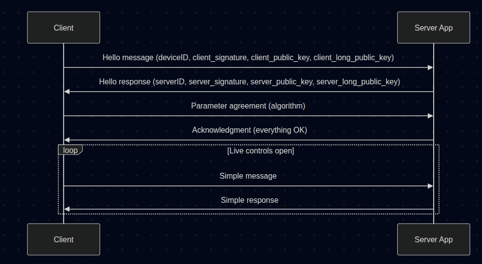

# Secure Communication IoT
The project is a software for both the client (IoT device like smartwatch) and a server (app server). The communication has encryption algorithms and prevents common attacks.

Secure Encrypted Communication System (Diffie-Hellman + ChaCha20)

This project implements a secure **Client-Server communication system** in C++. It uses modern cryptographic techniques such as **Diffie-Hellman key exchange** and **ChaCha20 encryption** to ensure confidentiality and integrity of messages.

The system supports:
- Secure handshake between client and server.
- Agreement on encryption parameters.
- Continuous encrypted message exchange.

---

## Libraries Used

This project uses the following libraries:

- libasio-dev — For asynchronous networking (socket communication).
- nlohmann-json3-dev — For JSON serialization and parsing.
- libsodium-dev — For cryptographic operations (Diffie-Hellman, ChaCha20).

---

## Installation (Linux)

Run the following commands to install the required dependencies:

```bash
sudo apt update
sudo apt install libasio-dev nlohmann-json3-dev libsodium-dev
```
---
## General outline
ToDo, put here a photo

## General communication


---
## Message Formats
## Client messages

Hello message
```json
{
    "method": "HelloFIUNAM",
    "device_ID": "<client id>",
    "nounce": <nonce>,
    "signature_hex": "<client signature>",
    "public_key_hex": "<client public key>",
    "long_term_public_key_hex": "<client long-term public key>"
}
```

Agree parameters message
```json
{
    "method": "AgreeParams",
    "algorithm": "<algorithm name>",
    "nounce": <nonce>
}
```

Simple message
```json
{
    "method": "simple_message",
    "message": "<your message>",
    "nounce": "<nonce>"
}
```

## Server messages

Hello Response

```json
{
    "method": "WhatsUpFIUNAM",
    "server_ID": "<server id>",
    "nounce": <nonce>,
    "signature_hex": "<server signature>",
    "public_key_hex": "<server public key>",
    "long_term_public_key_hex": "<server long-term public key>"
}
```

Start secure conversation
```json
{
    "method": "StartConversation",
    "OK": "<status (e.g., 'yes')>",
    "nounce": <nonce>
}
```

Simple response
```json
{
    "method": "conn_continue",
    "message": "<response message>",
    "nounce": "<nonce>"
}
```

# Enhanced Security: Robust Message Tampering Protection & Bidirectional Encryption
Introduces significant security enhancements to the communication protocol, primarily focusing on protecting against Message Tampering and ensuring bidirectional encrypted data exchange.

Key improvements include:

- Authenticated Decryption (src/utils/convert_data.h/.cc): The decrypt_message function has been refactored to explicitly validate the ChaCha20-Poly1305 authentication tag. It now returns a boolean indicating success or failure, and crucially, clears the output buffer upon detecting any message manipulation or invalidity.
- Active Tampering Mitigation (src/appserver/server.cc, src/client/client.cc): Both the server and client now actively check the authentication status of incoming decrypted messages. If a tampering attempt is detected (i.e., authentication fails), the connection is immediately terminated, preventing the processing of malicious or corrupted data.
- Bidirectional Encrypted Communication (src/appserver/server.cc): The server's responses are now also encrypted using session keys and randomly generated nonces, ensuring that all data exchange between client and server remains confidential and authentic.
- Local Tampering Simulation (Commented Code): For testing purposes, temporary code has been added (and commented out) in server.cc and client.cc to simulate a Message Tampering attack. This allows for direct verification of the implemented defenses by intentionally corrupting a received message. Instructions for activation are provided within the commented code sections.
